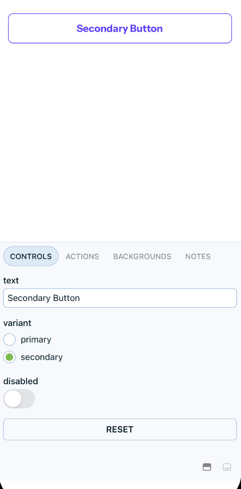
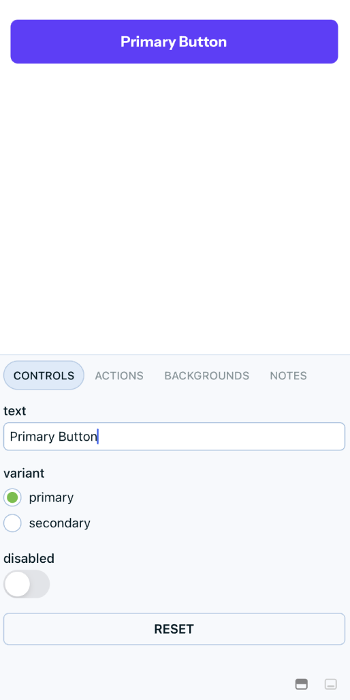

## React Native Minimal Design System

Most of the times before starting a project we need to start with a basic design system boilerplate. Usually we need to setup colors, typography, spacing and other basic stuff. This example aims to provide a minimal design system boilerplate for React Native projects.

### What is the output? What exactly are we going to build?

Given the following image of a design system we are going to create a boilerplate for it. Of course this is opinionated and you can use it for a reference and modify it according to your needs.


Tools that we are going to use:

1. [Nativewind(Tailwind for react native)](https://www.nativewind.dev/) - For setting up the design system and styling.
2. [Storybook for react native](https://github.com/storybookjs/react-native) - For component development and demonstration.

### Colors

Colors are setup in the `tailwind.config.js` file. You will see that we are using exactly the same name as listed in the design system image. For example,

```js
theme: {
    extend: {
      colors: {
        purple: "#633CFF",
        "purple-hover": "#BEADFF",
        "purple-light": "#EFEBFF",
        "dark-gray": "#333333",
        grey: "#737373",
        border: "#D9D9D9",
        "border-light": "#FAFAFA",
        red: "#FF3939",
      },
    },
  },
```

### Typography

Similar to colors, we have setup our typography inside the `<Text />` component. This is our common text component that we are going to use throughout the project. We just need to pass the variant name according to the design system and it will automatically apply the styles. For example,

```js
<Text variant="heading-medium">Hello World</Text>
or
<Text variant="body-small">Hello World</Text>
```

### Storybook

Each component is associated with a story file. The storybook setup files are located inside the `.storybook` and `.ondevice` folder. You can run the storybook on web by running the following command.

```bash
yarn storybook
```

To run the storybook on device, you can run the following command.

```bash
yarn storybook:ios
```

The storybook of a button component looks like the followin on device



